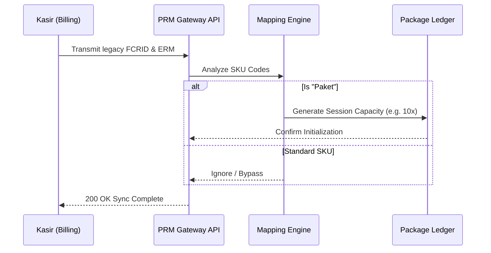
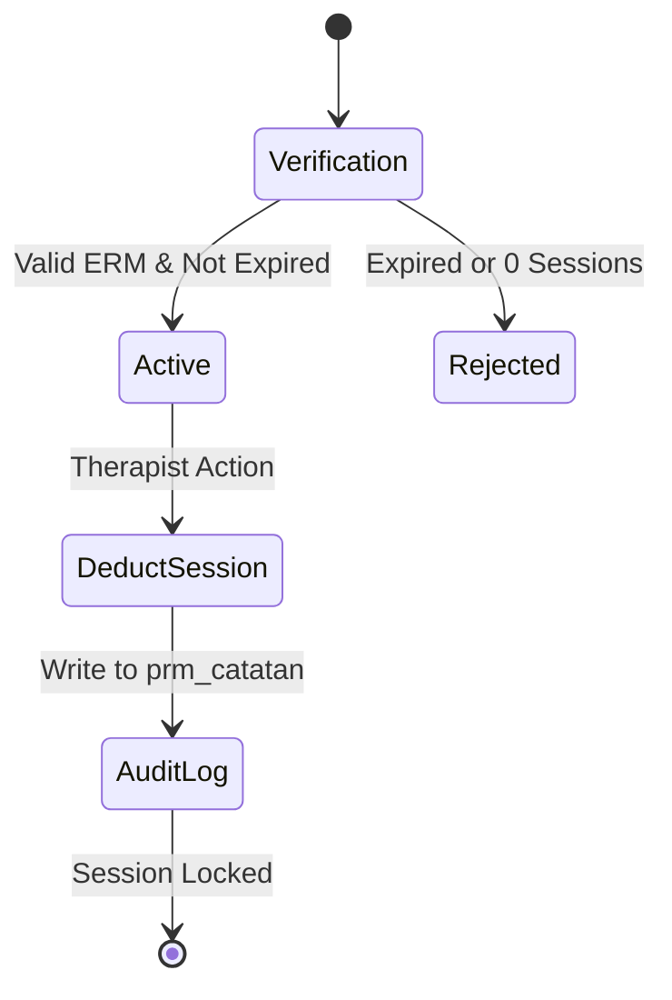
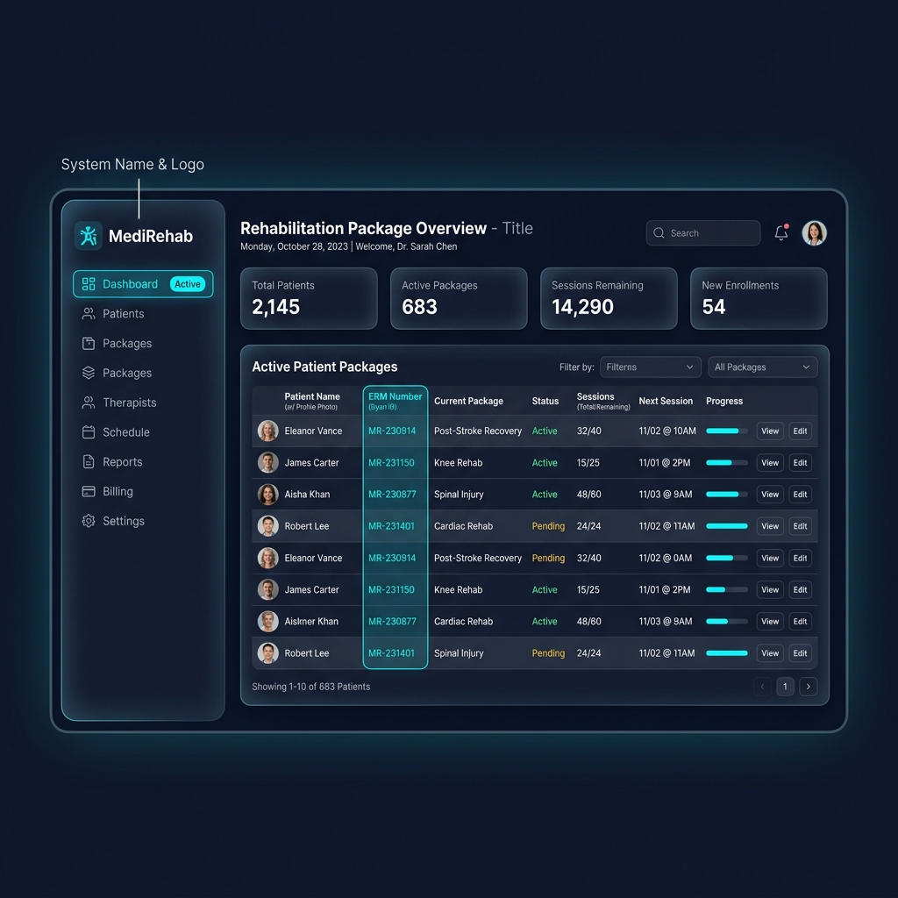

<div align="center">
  
  
  
  
  
  <br />
  <br />
  
  <h1 align="center">Medical Rehabilitation Package Management System</h1>
  <p align="center">
    A robust, scalable, and highly integrated package management solution designed to bridge modern frontend interfaces with legacy Hospital Information Systems (HIS).
  </p>
</div>

<hr />

## 📖 Table of Contents
- [System Architecture](#-system-architecture)
- [Key Workflows](#-key-workflows)
- [Design System & UI/UX](#-design-system--uiux)
- [Technical Stack](#-technical-stack)
- [Directory Structure](#-directory-structure)
- [Installation & Setup](#-installation--setup)
- [API Reference](#-api-reference)

---

## 🏗 System Architecture

The PRM (Paket Rehabilitasi Medis) System employs a decoupled logic within a monolithic physical deployment. It relies on a **Vanilla JS Single Page Application (SPA)** architecture on the frontend, communicating asynchronously with a **PHP REST-like API** backend via standard Fetch API protocols.

One of the most critical aspects of this system is its ability to seamlessly join and transform data from the legacy HIS `dbold` (Hospital Information System) with the new package capacity tables (`prm_kapasitas`, `prm_master_paket`).

---

## 🔄 Key Workflows

### 1. The Billing-to-Package Data Pipeline



When a transaction occurs in the legacy Billing/Kasir module, the data is pushed to `fisiosfjual` and `kasir_jual_h`. 
- **The Engine:** The Kasir Controller dynamically joins these legacy tables, parsing the `FCRID` (Receipt Register) and `FCRRMUNIT` (ERM).
- **The Action:** An automated script identifies SKUs designated as "Paket", maps them using `prm_kasir_paket_mapping`, and seamlessly generates session capacity ledgers for patients without manual double-entry.

### 2. Session Deduction Protocol



When a medical professional uses a session:
1. **Pre-flight Validation:** Verifies active session count and package expiration date.
2. **Transaction:** Deducts the session (`sisa_sesi`) and creates an immutable audit trail in `prm_catatan`.
3. **Rollback Safety:** Ensures atomicity in the event of an invalid ERM mapping.

---

## 🎨 Design System & UI/UX



This project implements a custom-built Design System heavily inspired by **Material Design 3 (MD3)** specifications, translated into utility classes using **TailwindCSS**.

### Color Tokens (Semantic Approach)
Instead of hardcoded colors, the system uses logical surface roles:
- `primary` / `on-primary` — Brand core actions (Buttons, Active States)
- `surface-container` / `on-surface` — Background layered hierarchies (Cards, Modals)
- `error` / `error-container` — Destructive actions and alerts.

### Typography
- **Headlines & Display:** Robust sans-serif scaling for dashboard metrics.
- **Data Tables:** Specialized `font-mono-data` for aligning medical record numbers and dates perfectly across rows.

### Interactions & Micro-Animations
- **Hover States:** Soft elevation and background transition (`transition-colors duration-200`).
- **Dark Mode Context:** The entire application supports native dynamic switching to dark mode based on the `dark` class, seamlessly inverting container depths without breaking contrast ratios.

---

## 💻 Technical Stack

- **Frontend:** HTML5, Vanilla ES6 JavaScript (No frameworks overhead), TailwindCSS (CDN compiled for edge speed).
- **Backend:** PHP 8+ PDO (PHP Data Objects) for secure SQL injection prevention.
- **Database:** MySQL / MariaDB (Relational mapping between Legacy HIS & New Module).

---

## 📁 Directory Structure

```text
prm_rkz/
├── local/
│   ├── api/
│   │   ├── config/
│   │   │   └── database.php        # Core DB Connection & PDO setup
│   │   ├── controllers/            # Business logic (KasirController, etc.)
│   │   └── models/                 # ORM-like entities (Paket.php, Kapasitas.php)
│   ├── index.html                  # Main SPA entry point & UI Views
│   └── app.js                      # Core frontend logic, routing, & DOM manipulation
└── README.md                       # You are here!
```

---

## ⚙️ Installation & Setup

### Prerequisites
- PHP >= 8.0
- MySQL >= 5.7 or MariaDB >= 10.3
- Apache / Nginx Server (e.g., XAMPP, Valet, Docker)

### Deployment Steps
1. **Clone Repository:**
   ```bash
   git clone https://github.com/louismax12/prm_rkz.git
   cd prm_rkz
   ```
2. **Database Configuration:**
   Copy or edit the database configuration located at `local/api/config/database.php`.
   ```php
   // Provide your legacy db credentials
   $this->host = "localhost";
   $this->db_name = "dbold";
   $this->username = "root";
   $this->password = "secret";
   ```
3. **Run the Application:**
   Serve the `local/` directory from your web server. Access the application at:
   `http://localhost/prm_rkz/local/index.html`

---

## 🔌 API Reference

The backend exposes a highly optimized routing endpoint via `index.php` (if configured) or direct controller calls.

| Endpoint | Method | Payload | Description |
|----------|--------|---------|-------------|
| `/api/kasir?action=history` | `GET` | `page, tanggal, status` | Fetches parsed legacy billing data |
| `/api/kasir?action=mark_processed` | `POST` | `JSON {ids: []}` | Locks a transaction & initializes patient capacity |
| `/api/pasien?action=all_kapasitas` | `GET` | `date` | Retrieves all active packages for the current date |
| `/api/pasien?action=gunakan_sesi` | `POST` | `JSON {id_kapasitas, ...}` | Deducts package sessions and generates logs |

---
*Built for scale. Engineered for reliability. Designed for the end-user.*

 👨‍💻 _made by Louis Maximillian_