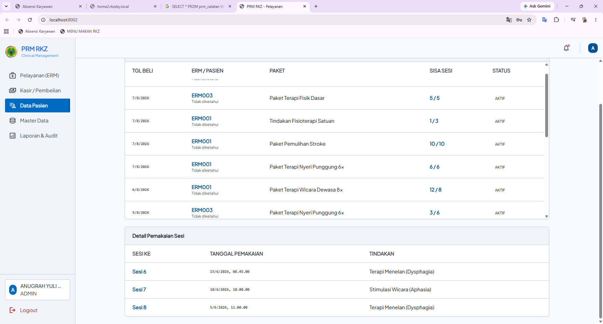

saya mau di menu pasien itu di ubah layout nya karena saya mau design UI dan ayoutnya itu yang tidak perlu scroll ke bawah...

Tolong perbarui struktur HTML dan CSS untuk halaman UI sistem CRM saya. Pada halaman ini, terdapat dua panel tabel yang bersebelahan: panel "Daftar Pasien (Kapasitas)" di sisi kiri dan panel "Detail Pemakaian Sesi" di sisi kanan. Kedua tabel ini akan menampung data besar hingga lebih dari 200 baris.

Berikut adalah detail kebutuhannya:

Buatkan struktur div wrapper (misalnya dengan class .table-scroll-container) untuk membungkus elemen <table> pada masing-masing panel (kiri dan kanan).

Berikan kode CSS untuk wrapper tersebut agar memiliki tinggi maksimal (misalnya max-height: 500px) dan bisa di-scroll secara vertikal (overflow-y: auto) tanpa membuat halaman utama ikut memanjang.

Lakukan kustomisasi pada scrollbar menggunakan pseudo-element ::-webkit-scrollbar. Pastikan thumb (pegangan scrollbar) terlihat sangat jelas (misalnya warna abu-abu gelap dengan track abu-abu terang) dengan ukuran lebar sekitar 8px.

Tambahkan CSS agar bagian header tabel (<th>) bersifat sticky (position: sticky; top: 0;), sehingga header tetap terlihat saat baris data di-scroll ke bawah.

Tolong berikan kode HTML dan CSS-nya secara lengkap dan terstruktur.

07 Agu 2026	2602967		TN TOTOK WONOWIJOYO	EM - LATIHAN MANUAL	Rp 240.000
07 Agu 2026	2602959		NY SOEKMAWATI	EM - LATIHAN MANUAL	Rp 212.000
07 Agu 2026	260802680	J016-03-41	TN MUSA ZEBAOTH TORAH BUWONO-L	EXCB - LATIHAN BERAT	Rp 330.000
07 Agu 2026	260802680	J016-03-41	TN MUSA ZEBAOTH TORAH BUWONO-L	MSMYO - MYOMED	Rp 330.000